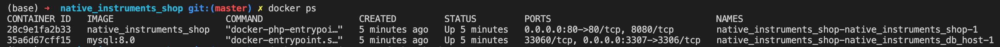

- [Native Instruments Shop Application](#native-instruments-shop-application)
  * [About The Application](#about-the-application)
  * [APIs](#apis)
  * [Local Setup and Testing the APIs](#local-setup-and-testing-the-apis)
    + [Local Setup using Docker](#local-setup-using-docker)
    + [Testing the Apis](#testing-the-apis)
    + [Postman Collection](#postman-collection)
    + [Clone the project using git](#clone-the-project-using-git)
  * [Running Tests](#running-tests)

# Native Instruments Shop Application
## About The Application 
This project is a product service with an HTTP API for products and users and the purchases of registerd users.

## APIs 
| API                          | Description                     |
|------------------------------|---------------------------------|
| GET /products                | return the list of products     |
| POST /register               | register new user               |
| POST /auth                   | get authorization token for user|
| GET /user                    | get authenticated user          |
| GET /user/products           | get purchased products for user |
| POST /user/products          | purchase new product            |
| DELETE /products /{SKU}      | delete purchased product        |
| POST /logout                 | logout user                     |


* Public routes 
- GET /products         
- POST /register
- POST /auth

* Protected routes
- GET /user
- GET /user/products
- POST /user/products
- DELETE /products /{SKU}
- POST /logout 

## Local Setup and Testing the APIs
### Local Setup using Docker
- Docker must be installed on your local machine.
- Open the terminal form the root directory of the application and run 
```
docker-compose up -d
```
- Check the running docker containers
```
docker ps
```

- First go inside the mysql container 
```
docker exec -it <container-id> bash
```
- After you go inside the docker container open the mysql and check for existing database
```
mysql -uroot -p
password: root
mysql> show databases;
mysql> create database native_instruments_db;
-- if database already created use it and check the tables
mysql> use native_instruments_db;
mysql> show tables;
mysql> select * from users;
mysql> select * from products;
```

- second go inside the application container
```
docker exec -it <container-id> bash
```
- After you go inside the docker container run the following commands 
```
composer install
php artisan migrate --seed
```

- To make sure the laravel host is working check on the browser http://0.0.0.0:80/
  then you can test the apis using this host.

- you can call the APis and make changes to the data, then stop the running container and start it again to check if the data still persist, but you don't need to run the migrations in the second time.
```
docker-compose down
```
### Testing the Apis
the apis can be tested using postman 
host name http://0.0.0.0:80/
- Note to set header name "Accept" and the value is "application/json"

Post requests body 
- /register 
   name - email - password - password-confirmation
- /auth 
   email - password
- post /user/products
   product_sku   

### Postman Collection
You can find the postman collection in the root directory, you just need to export to your postman and use for testing the APIs.
Native Instruments API Docker Container.postman_collection.json

### Clone the project using git
for clonning the project from github repo you need to copy .env.example to .env file and fill the db connection data
```
DB_CONNECTION=mysql
DB_HOST=native_instruments_db_host
DB_PORT=3306
DB_DATABASE=native_instruments_db
DB_USERNAME=root
DB_PASSWORD=root
```
you must do this before run the project using docker-compose up 

## Running Tests
I didn't complete all the tests required for this repository, but to the run the test you need to go inside the docker container for the application and run the test, keep in mind that executing the test will clear all the database tables, so you may after that want to run the seeds again.

To run the tests from inside the docker image
```
php artisan test
```
or 
```
./vendor/bin/phpunit
```

Note: if you faced any problem with the migrations just fresh the migrations and seed the data again 
```
php artisan migrate:fresh
php artisan db:seed
```